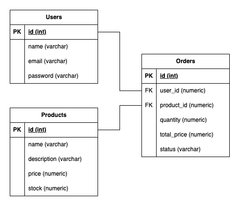

# Challenge

A simple RESTful API project with an E-Commerce use case.

## Features

- **JWT Authentication**: Uses JWT tokens for user authentication.
- **User Management**: Functions for login, registration, and managing user data.
- **Product Management**: Add, update, and delete products.
- **Order Management**: Place orders and update stock levels.

## Bonus

- [x] API Documentation
- [x] Dockerized
- [ ] Automated Testing
- [x] Architecture Diagram

## Prerequisites

Before running this project, make sure to install:

- [Go](https://golang.org/dl/)
- [Docker](https://docker.com/)
<!-- - [PostgreSQL](https://www.postgresql.org/download/) or other databases (depending on `.env` configuration) -->

## Installation

1. **Clone this repository**:

```bash
git clone https://github.com/username/repository-name.git
cd repository-name
```

2. **Install dependencies**:
```bash
go mod tidy
```

3. **Create a `.env` file**:
```env
JWT_SECRET_KEY=your_jwt_secret_key
SERVER_PORT=8080
```

4. **Run the application**:
```bash
go run main.go
```

## Docker

```bash
docker-compose up --build
```

## API Documentation

- Accessible at [Postman Documentation](https://documenter.getpostman.com/view/1475503/2sAYQZJCwZ) or https://documenter.getpostman.com/view/1475503/2sAYQZJCwZ

## ER Diagram


